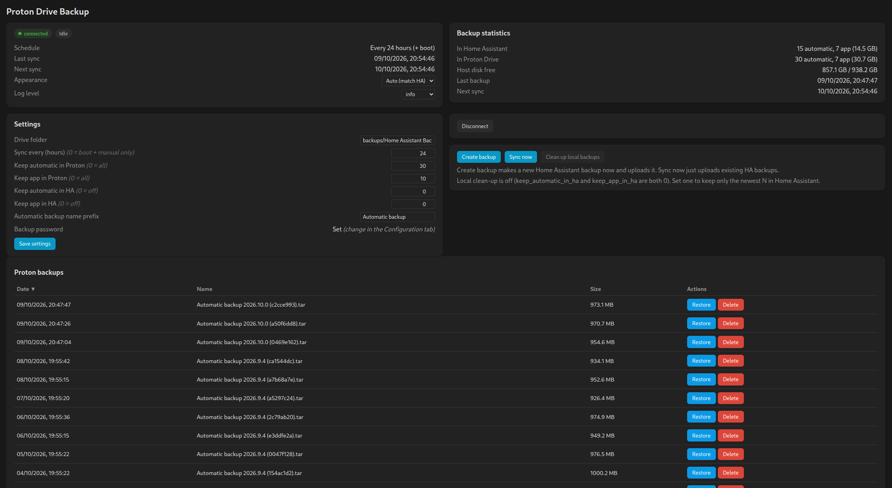

# Proton Drive Backup for Home Assistant

A Home Assistant app (add-on) that copies your Home Assistant backups to
[Proton Drive](https://proton.me/drive), like the Google Drive backup add-on.
It uses Proton's official [`proton-drive`](https://proton.me/support/proton-drive-cli)
CLI, and you sign in through Proton's own browser login, so the app never sees
your Proton password.

## Features

- Uploads every Home Assistant backup not yet in Proton, on boot, every N hours,
  or when you press **Sync now**. **Create backup** makes a new full backup and
  uploads it.
- Keeps the newest N backups in Proton, with separate limits for automatic and
  other backups, so a burst of per-app backups can't push out the scheduled
  ones. Pruned backups go to the Drive trash, or are deleted for good with
  `permanently_delete`.
- Optional local clean-up that only removes backups already verified in Proton.
- Restore and delete straight from the panel, plus live sync progress and stats.

## Requirements

- Home Assistant OS or Supervised (apps don't exist on Core / Container).
- amd64 or aarch64. Proton ships no CLI build for other architectures.

## Install

1. **Settings → Apps → App store → ⋮ → Repositories**, add
   `https://github.com/nicandris/ha-addon-proton-drive-backup`.
2. Install **Proton Drive Backup** and start it.
3. Open the panel, click **Connect to Proton Drive** and finish sign-in from the
   link it shows, on any device.

Options, the panel and restore are covered in
[DOCS.md](proton_drive_backup/DOCS.md), which is also the app's Documentation
tab in Home Assistant.

## Security

Backups are end-to-end encrypted by Proton before upload. The CLI's session
token is stored as a plain file in the app's `/data` directory, because the
container has no keyring. Keep the HA host and its backups protected, and
**Disconnect** to revoke the session.

## Disclaimer

A community project, not affiliated with or supported by Proton AG. MIT licensed.
